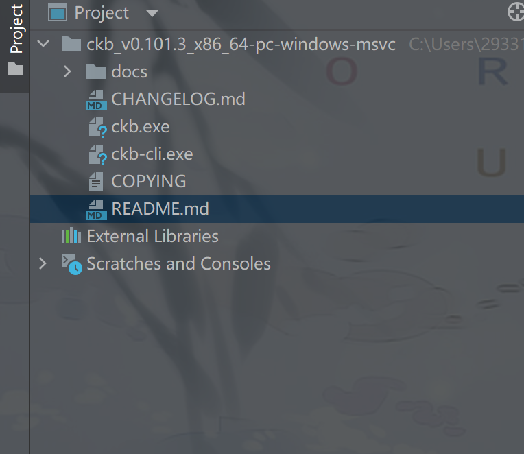
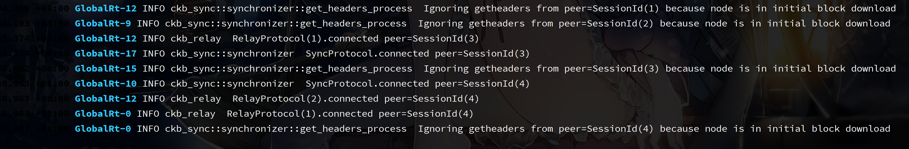
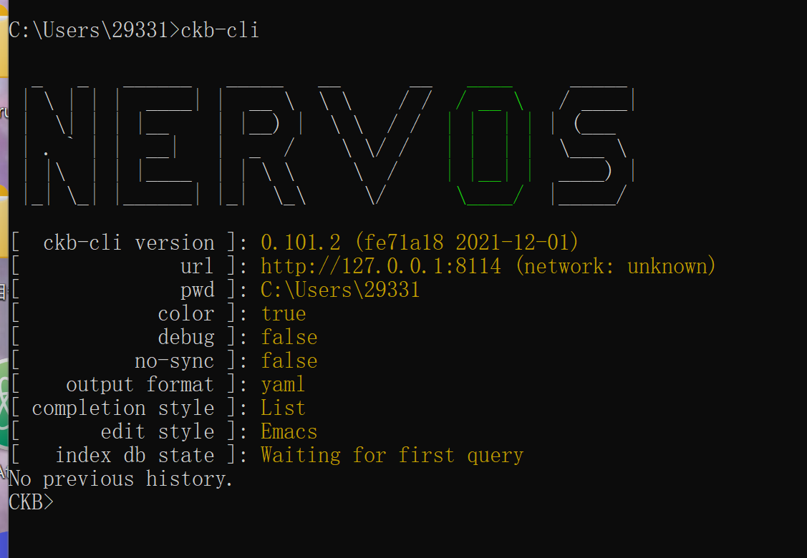
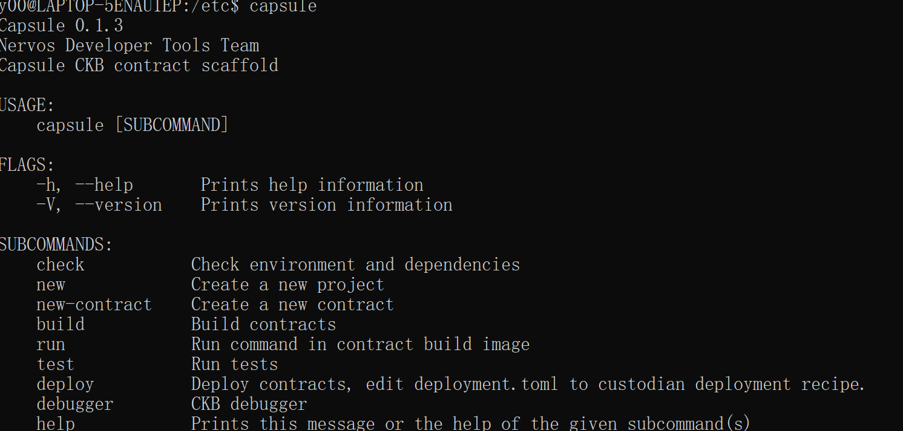

# rust_pipeline_for_capsule

> 如果img不显示，采用纸飞机翻墙可见


Capsule是一套供 Rust 开发者在 CKB 上开发脚本的工具，涵盖了脚本开发的整个生命周期：编写、调试、测试和部署。

这里给出部署的流程和最终结果。

* [x]  从CKB 发布页面下载最新的二进制文件。

```txt
验证  二进制文件是否正常工作并检查版本
ckb --version 
ckb-cli --version
```



* [x] CKB Quick Start

run之后：


ckb节点已经成功run

* [x] 添加ckb-cli到PATH环境变量中


* [x] 安装docker
from https://docs.docker.com/desktop/windows/install/
等待下载，下载完成
安装...
安装遇到问题，需要wsl2 

参考 https://zhuanlan.zhihu.com/p/337104547

wsl2启用

参考
https://docs.microsoft.com/en-us/windows/wsl/install-manual#step-4---download-the-linux-kernel-update-package


hyper-v在系统设置里启用

powershell中启用
Enable-WindowsOptionalFeature -Online -FeatureName Microsoft-Hyper-V -All

这时候docker可以正常启用

powershell中输入docker run hello-world

```
Hello from Docker!
This message shows that your installation appears to be working correctly.

To generate this message, Docker took the following steps:
 1. The Docker client contacted the Docker daemon.
 2. The Docker daemon pulled the "hello-world" image from the Docker Hub.
    (amd64)
 3. The Docker daemon created a new container from that image which runs the
    executable that produces the output you are currently reading.
 4. The Docker daemon streamed that output to the Docker client, which sent it
    to your terminal.

To try something more ambitious, you can run an Ubuntu container with:
 $ docker run -it ubuntu bash

Share images, automate workflows, and more with a free Docker ID:
 https://hub.docker.com/

For more examples and ideas, visit:
 https://docs.docker.com/get-started/
```

这说明docker的安装是成功的

* [x]  安装 capsule

```txt
进入workspace
cargo install capsule --git https://github.com/nervosnetwork/capsule.git --tag v0.1.3
```

build失败


在wsl中安装一个Ubuntu发行版

学习wsl Ubuntu和本地文件互操作，复制粘贴等

测试apt-get和curl

安装 Rust 和 Cargo

curl https://sh.rustup.rs -sSf | sh

source $HOME/.cargo/env 

wsl下测试cargo成功

linux中安装docker  ref: https://docs.docker.com/get-docker/


更换源：
```
[source.crates-io] 
registry = "https://github.com/rust-lang/crates.io-index" 
replace-with = 'ustc' [source.ustc] 
registry = "git://mirrors.ustc.edu.cn/crates.io-index" 
# 如果所处的环境中不允许使用 git 协议，可以把上面的地址改为 
# registry = "https://mirrors.ustc.edu.cn/crates.io-index" #[http] #check-revoke = false
```

然后执行
cargo install capsule --git https://github.com/nervosnetwork/capsule.git --tag v0.1.3


网络原因和其他原因报错较多，采用源码编译。

cargo build --release

错误整理：

link cc not found：https://blog.csdn.net/Betterc5/article/details/101197571

run custom build command for openssl-sys v0.9.55：https://zhuanlan.zhihu.com/p/138180011 + install pkg-config

然后把release路径在etc里的配置文件里添加到全局变量



现在我们可以全局运行capsule了

```
y00@LAPTOP-5ENAU1EP:/etc$ capsule check
------------------------------
docker  not found - Please install docker
ckb-cli not found - The deployment feature is disabled
------------------------------
```

* [x] 创建一个项目

capsule new my-sudt

发现文件和官方文档对不上。原来版本错了，重新下载最新版本再重复一次上述过程。

```
Capsule 0.7.2 #可见现在的版本号是latest
Nervos Developer Tools Team
Capsule CKB contract scaffold

USAGE:
    capsule [SUBCOMMAND]

FLAGS:
    -h, --help       Prints help information
    -V, --version    Prints version information

SUBCOMMANDS:
    check           Check environment and dependencies
    new             Create a new project
    new-contract    Create a new contract
    build           Build contracts
    run             Run command in contract build image
    test            Run tests
    deploy          Deploy contracts, edit deployment.toml to custodian deployment recipe.
    clean           Remove contracts targets and binaries
    debugger        CKB debugger
    help            Prints this message or the help of the given subcommand(s)
```

Unable to find image 'thewawar/ckb-capsule:2021-12-25' locally

docker: Error response from daemon: cgroups: cannot find cgroup mount destination: unknown.
error: docker container exit with code Some(125)

docker可能有问题，试试docker run hello-world
提示CODE【0000】 

```
通过以下命令解决
sudo mkdir /sys/fs/cgroup/systemd 
sudo mount -t cgroup -o none,name=systemd cgroup /sys/fs/cgroup/systemd
```
接下来重新创建capsule初始项目
```
y00@LAPTOP-5ENAU1EP:/mnt/c/Users/29331/Desktop/rust_workspace/my-sudt$ ls

Cargo.toml  README.md  build  capsule.toml  contracts  deployment.toml  migrations  tests

y00@LAPTOP-5ENAU1EP:/mnt/c/Users/29331/Desktop/rust_workspace/my-sudt$ cd contracts/
y00@LAPTOP-5ENAU1EP:/mnt/c/Users/29331/Desktop/rust_workspace/my-
sudt/contracts$ ls

my-sudt

y00@LAPTOP-5ENAU1EP:/mnt/c/Users/29331/Desktop/rust_workspace/my-sudt/contracts$ cd my-sudt/
y00@LAPTOP-5ENAU1EP:/mnt/c/Users/29331/Desktop/rust_workspace/my-
sudt/contracts/my-sudt$ ls

Cargo.toml  src
```
从目录层级来看是正常的

* [x] 构建项目

```
cd my-sudt 
capsule build
```
获取到了二进制文件，构建成功
```
y00@LAPTOP-5ENAU1EP:/mnt/c/Users/29331/Desktop/rust_workspace/my-sudt/build/debug$ ls
my-sudt
```

* [x] 检查toml中使用的库

* [x] 编写 SUDT 脚本

添加  core::arch::asm; 并用nightly版本rustc 1.59.0-nightly (404c8471a 2021-12-14)   

```
Building contract my-sudt
   Compiling memchr v2.4.1
   Compiling cc v1.0.72
   Compiling cfg-if v1.0.0
   Compiling cty v0.2.2
   Compiling buddy-alloc v0.4.1
   Compiling molecule v0.7.2
   Compiling ckb-standalone-types v0.1.2
   Compiling ckb-std v0.9.0
   Compiling cstr_core v0.2.4
   Compiling my-sudt v0.1.0 (/code/contracts/my-sudt)
    Finished dev [unoptimized + debuginfo] target(s) in 9.39s
Done
```

* [x] 检查默认测试

```txt
capsule test

> 等待环境编译...
running 2 tests
thread 'tests::test_empty_args' panicked at 'error_string: Script(TransactionScriptError { source: Inputs[0].Lock, cause: ValidationFailure: see the error code 4 in the page https://nervosnetwork.github.io/ckb-script-error-codes/by-data-hash/58f4aa3a0126222b691e72ebe26f13917293d542a6e24691b06496e7bdb6823d.html#4 }), expected_error_code: 5', tests/src/tests.rs:18:5
note: run with `RUST_BACKTRACE=1` environment variable to display a backtrace
thread 'tests::test_success' panicked at 'pass verification: Error { kind: Script, inner: TransactionScriptError { source: Inputs[0].Lock, cause: ValidationFailure: see the error code 4 in the page https://nervosnetwork.github.io/ckb-script-error-codes/by-data-hash/58f4aa3a0126222b691e72ebe26f13917293d542a6e24691b06496e7bdb6823d.html#4 } }', tests/src/tests.rs:77:10
test tests::test_success ... FAILED
test tests::test_empty_args ... FAILED

failures:

failures:
    tests::test_empty_args
    tests::test_success

test result: FAILED. 0 passed; 2 failed; 0 ignored; 0 measured; 0 filtered out; finished in 0.35s
```
这里发现和官方文档的错误不太一样 虽然都是ValidationFailure 但是发生的线程不同，我们是'tests::test_empty_args'和 'tests::test_success' ，而官方教程是'tests::test_basic'，想必可能是版本变更造成的。
